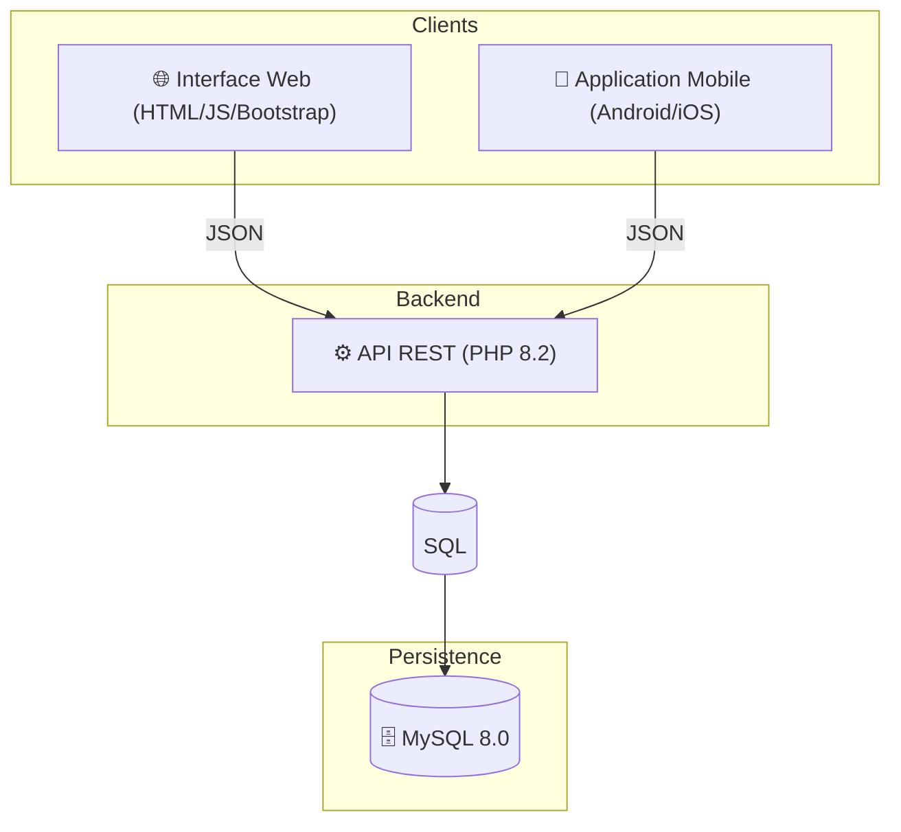

# TontiFaso 🏦

[](https://www.docker.com/)
[](https://www.php.net/)
[](https://www.mysql.com/)

**TontiFaso** est une solution moderne de gestion de tontines et de microfinance. Ce projet académique et professionnel vise à digitaliser les cercles d'épargne traditionnels grâce à une architecture robuste et multi-plateforme.

---

## 📑 Sommaire
- [Architecture du Projet](#-architecture-du-projet)
- [Base de Données](#-base-de-données)
- [Backend & API REST](#-backend--api-rest)
- [Connexion de l'Application Mobile](#-connexion-de-lapplication-mobile)
- [Installation & Déploiement](#-installation--déploiement)

---

## 🏗 Architecture du Projet

Le système repose sur une base de données MySQL centrale, partagée par deux interfaces distinctes.



### Composants :
- **🌐 Web** : Frontend responsive utilisant du JavaScript pur pour une expérience utilisateur fluide.
- **📱 Mobile** : Application native ou cross-plateforme consommant les services de l'API.
- **⚙️ Backend** : API RESTful en PHP gérant la logique métier et la sécurité.
- **🐳 Docker** : Environnement conteneurisé assurant une isolation et une portabilité totale.

---

## 🗄 Base de Données

La base de données officielle du projet est nommée `tontifaso`. Elle sert de source unique de vérité.

### Tables Principales

| Table | Rôle | Relations |
| :--- | :--- | :--- |
| **`users`** | Profils utilisateurs (Auth, Admin, Membres). | Pivot central. |
| **`tontines`** | Groupes d'épargne et leurs paramètres. | Créées par un `user`. |
| **`members`** | Lien entre un utilisateur et une tontine. | `users` ↔ `tontines`. |
| **`contributions`**| Dépôts effectués par les membres. | Liées à `users` et `tontines`. |
| **`loans`** | Prêts accordés aux membres. | Liées à `members`. |
| **`guarantees`** | Garanties adossées aux prêts. | Liées à `loans`. |
| **`payments`** | Remboursements de prêts. | Liées à `loans` et `members`. |
| **`transactions`** | Historique complet des flux financiers. | Audit de toutes les opérations. |
| **`notifications`**| Alertes et rappels pour les utilisateurs. | Liées à `users`. |

> [!IMPORTANT]
> Chaque modification système (dépôt, prêt) génère automatiquement une entrée dans la table `transactions` pour garantir la traçabilité.

---

## ⚙️ Backend & API REST

Le backend communique exclusivement via **JSON**. Les ports par défaut sont configurés pour une accessibilité immédiate.

### Points de Terminaison (Endpoints)

#### 🔐 Authentification
- `POST /backend/auth/login.php` : Connexion et création de session.
- `POST /backend/auth/register.php` : Création de compte membre.
- `GET /backend/auth/logout.php` : Déconnexion.

#### 📊 Synchronisation
- `GET /backend/api/get_data.php` : Récupère l'intégralité des données (membres, prêts, dépôts) en une seule requête optimisée.

#### 📁 Gestion Métier
- **Membres** : `POST /backend/api/update_member.php`, `POST /backend/api/delete_member.php`
- **Tontines** : `GET /backend/tontines/list.php`, `POST /backend/tontines/create.php`
- **Prêts** : `POST /backend/api/add_loan.php`, `POST /backend/api/add_payment.php`
- **Dépôts** : `POST /backend/contributions/add.php`

---

## 📱 Connexion de l'Application Mobile

L'application mobile doit agir comme une extension de l'écosystème TontiFaso. Voici comment s'interfacer avec le backend.

### 🔗 Configuration de base
1. **Base URL** : Utilisez l'adresse IP de la machine hôte. Exemple : `http://192.168.1.XX:8080/`.
2. **Authentification** : Le backend utilise `PHPSESSID` pour la session. Le mobile doit capturer le cookie `Set-Cookie` lors du login et le renvoyer dans chaque requête.

### 🛠 Exemples d'API (JSON)

#### 1. Authentification (`POST /backend/auth/login.php`)
**Requête (Multipart/Form-Data) :**
- `email`: `user@test.com`
- `password`: `password123`

**Réponse (Success) :**
```json
{
    "success": true,
    "message": "Login successful",
    "user": { "id": 5, "fullname": "Verify User", "role": "user" }
}
```

#### 2. Synchronisation Globale (`GET /backend/api/get_data.php`)
Cet endpoint renvoie **tout** l'état de la base pour une mise à jour locale immédiate.
```json
{
    "success": true,
    "data": {
        "members": [ { "id": 3, "firstName": "Steve", "lastName": "TO", ... } ],
        "deposits": [ { "id": 1, "memberId": 3, "amount": "2000.00", ... } ],
        "loans": [ { "id": 1, "memberId": 5, "principal": "100000.00", ... } ]
    }
}
```

### 💻 Exemple de Code (Dart/Flutter)

Voici comment implémenter un appel API simple avec le package `http` :

```dart
import 'package:http/http.dart' as http;
import 'dart:convert';

class TontiService {
  final String baseUrl = "http://192.168.1.XX:8080";
  String? _sessionCookie;

  Future<bool> login(String email, String password) async {
    var response = await http.post(
      Uri.parse("$baseUrl/backend/auth/login.php"),
      body: {'email': email, 'password': password},
    );

    if (response.statusCode == 200) {
      var result = jsonDecode(response.body);
      if (result['success']) {
        // Stocker le cookie pour les prochaines requêtes
        _sessionCookie = response.headers['set-cookie'];
        return true;
      }
    }
    return false;
  }

  Future<Map?> fetchData() async {
    var response = await http.get(
      Uri.parse("$baseUrl/backend/api/get_data.php"),
      headers: {'cookie': _sessionCookie ?? ''},
    );
    return response.statusCode == 200 ? jsonDecode(response.body) : null;
  }
}
```

---

## 🐳 Installation & Déploiement

Le projet est entièrement prêt à l'emploi via Docker Compose.

### Pré-requis
- Docker Desktop installé.
- Git.

### Lancement
1. Clonez le projet.
2. Ouvrez un terminal dans le dossier racine.
3. Exécutez la commande :
   ```bash
   docker-compose up -d
   ```

### Accès Rapides
- **Application Web** : [http://localhost:8080](http://localhost:8080)
- **phpMyAdmin** : [http://localhost:8081](http://localhost:8081)
- **Port MySQL** : `3307`

---
*Ce projet a été conçu pour allier simplicité d'usage et rigueur financière. Pour toute question technique, contactez l'équipe de développement TontiFaso.*
