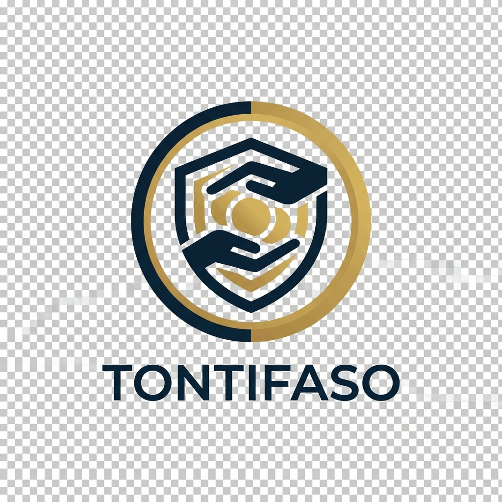

# TontiFaso - Système de Gestion de Microfinance



## 📋 Présentation

TontiFaso est une application web complète de gestion de microfinance développée en **HTML, CSS, JavaScript** et **Bootstrap 5**. L'application utilise un backend **PHP** avec une base de données **MySQL** pour la persistance des données.

### 🎨 Design

- **Couleur principale :** `#0B1C2D` (Bleu foncé)
- **Couleur secondaire :** `#C9A24D` (Or)
- **Couleur de fond :** `#F5F7FA` (Gris clair)
- **Design moderne, élégant et responsive** adapté pour desktop et mobile

## ✨ Fonctionnalités

### 1️⃣ Dashboard
- Vue d'ensemble avec statistiques en temps réel
- Cartes de statistiques : Membres, Dépôts, Prêts, Garanties
- Graphiques interactifs (Chart.js) :
  - Évolution des dépôts
  - Distribution des prêts par statut
  - Garanties par membre
- Mise à jour dynamique des données

### 2️⃣ Gestion des Membres
- **Ajouter** un membre avec informations complètes
- **Modifier** les informations d'un membre
- **Supprimer** un membre (avec vérification des données associées)
- **Rechercher** par nom, email ou téléphone
- Validation des formulaires (email, téléphone, champs requis)
- Stockage automatique dans localStorage

### 3️⃣ Gestion des Dépôts
- Historique complet des dépôts
- **Ajouter** un dépôt avec :
  - Sélection du membre
  - Montant
  - Date
  - Description
- **Calcul automatique** du total des dépôts
- Tri par date (du plus récent au plus ancien)
- Statistiques : total, nombre, moyenne

### 4️⃣ Gestion des Prêts
- Historique complet des prêts avec détails
- **Créer un prêt** avec :
  - Sélection du membre
  - Montant du capital
  - Taux d'intérêt mensuel (%)
  - Durée en mois
  - Date de début
  
#### 📊 Calculs Financiers Exacts

**Formule utilisée : Intérêt Simple**

```
Intérêt Total = Capital × (Taux/100) × Durée
Montant Total = Capital + Intérêt Total
Paiement Mensuel = Montant Total / Durée
```

**Exemple de calcul :**
- Capital : 200 000 FCFA
- Taux : 2% par mois
- Durée : 12 mois
- **Intérêt Total** = 200 000 × 0.02 × 12 = **48 000 FCFA**
- **Montant Total** = 200 000 + 48 000 = **248 000 FCFA**
- **Paiement Mensuel** = 248 000 / 12 = **20 667 FCFA**

**Fonctionnalités supplémentaires :**
- Aperçu en temps réel des calculs avant validation
- Suivi des remboursements
- Mise à jour du solde restant
- Statut automatique (Actif / Remboursé)
- Barre de progression du remboursement
- Historique détaillé des paiements

### 5️⃣ Gestion des Garanties
- **Ajouter** une garantie liée à un prêt
- Types de garanties : Immobilier, Véhicule, Équipement, Terrain, etc.
- **Analyse de couverture** en temps réel :
  - Ratio de couverture = (Valeur Garantie / Montant Prêt) × 100
  - Indicateurs visuels (vert > 100%, orange 50-100%, rouge < 50%)
- Statistiques : valeur totale, nombre de garanties
- **Filtrage** : prêts avec/sans garantie
- **Rapports** : couverture par prêt et par membre

### 6️⃣ Rapports Financiers
- **Vue globale** avec cartes de statistiques
- **Tableau détaillé** par membre :
  - Total des dépôts
  - Total des prêts
  - Total des garanties
  - Solde (Dépôts - Prêts)
- **Graphiques analytiques** :
  - Répartition des dépôts par membre (Pie chart)
  - Prêts par membre (Bar chart)
  - Vue d'ensemble financière comparative
- Tous les totaux calculés automatiquement

### 7️⃣ Profil & Administration
- Affichage du profil administrateur
- Statistiques du système
- **Export des données** en JSON
- **Réinitialisation** complète des données
- Déconnexion fonctionnelle
- Informations sur l'application

## 🚀 Installation et Utilisation

### Option 1 : Utilisation avec PHP (Serveur Local)

1. **Configurer** votre base de données MySQL et importer le schéma (voir `backend/config/database.php`).
2. **Lancer** le serveur PHP :
```bash
php -S localhost:8000
```
3. **Accéder** à l'application via `http://localhost:8000`.

> [!NOTE]
> En mode développement, l'application est configurée pour s'authentifier automatiquement en tant qu'administrateur.

### Option 3 : Docker

#### Construire l'image Docker

```bash
docker build -t tontifaso .
```

#### Lancer le conteneur

```bash
docker run -d -p 8080:80 --name tontifaso-app tontifaso
```

#### Accéder à l'application

```
http://localhost:8080
```

#### Arrêter et supprimer le conteneur

```bash
docker stop tontifaso-app
docker rm tontifaso-app
```

## 📂 Structure du Projet

```
Projet_Web/
├── index.html              # Page principale
├── assets/
│   └── logo.png           # Logo TontiFaso
├── css/
│   └── style.css          # Styles globaux et design system
├── js/
│   ├── app.js             # Initialisation de l'application
│   ├── router.js          # Système de routing
│   ├── data-manager.js    # Gestion des données (localStorage)
│   ├── calculations.js    # Calculs financiers
│   └── pages/
│       ├── dashboard.js   # Page Dashboard
│       ├── members.js     # Page Membres
│       ├── deposits.js    # Page Dépôts
│       ├── loans.js       # Page Prêts
│       ├── guarantees.js  # Page Garanties
│       ├── reports.js     # Page Rapports
│       └── profile.js     # Page Profil
├── Dockerfile             # Configuration Docker
├── .dockerignore          # Fichiers exclus du build Docker
└── README.md              # Ce fichier
```

## 🧪 Comment Tester l'Application

### 1. Données d'exemple

L'application initialise automatiquement des données d'exemple au premier lancement :
- 3 membres
- 4 dépôts
- 2 prêts
- 2 garanties

### 2. Test des fonctionnalités principales

#### Test 1 : Ajouter un membre
1. Aller sur la page **Membres**
2. Cliquer sur **Ajouter un Membre**
3. Remplir le formulaire avec :
   - Prénom : Moussa
   - Nom : Diallo
   - Email : moussa.diallo@email.com
   - Téléphone : +226 76 54 32 10
   - Adresse : Koupéla, Burkina Faso
   - Date : Aujourd'hui
4. Cliquer sur **Enregistrer**
5. ✅ Vérifier que le membre apparaît dans le tableau

#### Test 2 : Créer un prêt avec calculs exacts
1. Aller sur la page **Prêts**
2. Cliquer sur **Nouveau Prêt**
3. Remplir :
   - Membre : Sélectionner un membre
   - Capital : **100 000 FCFA**
   - Taux : **2.5%** par mois
   - Durée : **6 mois**
   - Date : Aujourd'hui
4. Observer l'aperçu des calculs :
   - Intérêt : 100 000 × 0.025 × 6 = **15 000 FCFA**
   - Total : **115 000 FCFA**
   - Mensualité : **19 167 FCFA**
5. Cliquer sur **Créer le Prêt**
6. ✅ Vérifier les calculs dans le tableau

#### Test 3 : Ajouter un remboursement
1. Sur la page **Prêts**, cliquer sur l'icône 💰 (Remboursement)
2. Entrer un montant (par exemple : **20 000 FCFA**)
3. Valider
4. ✅ Vérifier que :
   - Le montant payé augmente
   - Le solde restant diminue
   - La barre de progression s'actualise

#### Test 4 : Ajouter une garantie avec analyse
1. Aller sur **Garanties**
2. Cliquer sur **Ajouter une Garantie**
3. Sélectionner un prêt actif
4. Type : **Bien immobilier**
5. Valeur : **150 000 FCFA**
6. Observer l'analyse de couverture en temps réel
7. ✅ Vérifier le ratio de couverture dans le tableau

#### Test 5 : Consulter les rapports
1. Aller sur **Rapports**
2. ✅ Vérifier :
   - Les statistiques globales
   - Le tableau par membre avec tous les totaux
   - Les 3 graphiques interactifs

### 3. Test de la persistance des données

1. Ajouter des données (membre, dépôt, prêt)
2. **Rafraîchir** la page (F5)
3. ✅ Vérifier que toutes les données sont toujours présentes

### 4. Test responsive

1. Ouvrir les outils de développement (F12)
2. Activer le mode appareil mobile
3. Tester différentes tailles d'écran
4. ✅ Vérifier :
   - Le menu devient un bouton hamburger
   - Les tableaux sont scrollables horizontalement
   - Les cartes s'empilent correctement
   - Les graphiques s'adaptent

### 5. Export des données

1. Aller sur **Profil**
2. Cliquer sur **Exporter les Données**
3. ✅ Un fichier JSON est téléchargé avec toutes les données

## 💡 Technologies Utilisées

- **HTML5** - Structure
- **CSS3** - Styles et design
- **JavaScript (ES6+)** - Logique applicative
- **Bootstrap 5.3** - Framework CSS responsive
- **Bootstrap Icons** - Icônes
- **Chart.js 4.4** - Graphiques interactifs
- **localStorage** - Persistance des données
- **Docker** - Conteneurisation

## 📊 Formules de Calcul

### Intérêt Simple
```
Intérêt = Capital × (Taux/100) × Durée
```

### Montant Total du Prêt
```
Total = Capital + Intérêt
```

### Paiement Mensuel
```
Mensualité = Total / Durée
```

### Solde Restant
```
Solde = Total - Montant Payé
```

### Ratio de Couverture
```
Couverture (%) = (Valeur Garantie / Capital Prêt) × 100
```

## 🔒 Sécurité et Données

- **Toutes les données sont stockées localement** dans le navigateur (localStorage)
- **Aucune donnée n'est envoyée** vers un serveur externe
- Les données persistent tant que le cache du navigateur n'est pas vidé
- Pour **sauvegarder** vos données, utilisez la fonction **Export**
- Pour **réinitialiser**, utilisez la fonction dans le profil

## 🎓 Utilisation pour Soutenance

### Points à mettre en avant

1. **Application 100% fonctionnelle** dans le navigateur
2. **Calculs exacts** et vérifiables en direct
3. **Design professionnel** et uniforme
4. **Navigation fluide** entre toutes les pages
5. **Responsive** - fonctionne sur tous les appareils
6. **Données persistantes** via localStorage
7. **Déploiement facile** avec Docker

### Démonstration recommandée

1. **Présenter le Dashboard** - Vue d'ensemble
2. **Créer un membre** - Montrer la validation
3. **Créer un prêt** - Montrer les calculs en direct
4. **Ajouter un remboursement** - Montrer la mise à jour
5. **Ajouter une garantie** - Montrer l'analyse de couverture
6. **Consulter les rapports** - Montrer les graphiques
7. **Exporter les données** - Montrer la fonctionnalité

## 🐛 Résolution de Problèmes

### Les données ne s'affichent pas
- Vider le cache du navigateur et recharger
- Vérifier la console JavaScript (F12)

### Les graphiques ne s'affichent pas
- Vérifier la connexion internet (Chart.js chargé via CDN)
- Actualiser la page

### Réinitialiser l'application
- Aller dans **Profil** → **Réinitialiser les Données**
- Ou vider le localStorage manuellement via la console :
  ```javascript
  localStorage.clear();
  location.reload();
  ```

## 📝 Notes pour le Professeur

- ✅ **Tous les calculs sont exacts** et utilisent la formule d'intérêt simple
- ✅ **Toutes les fonctionnalités sont opérationnelles** directement dans le navigateur
- ✅ **Aucune dépendance** à une base de données - fonctionne immédiatement
- ✅ **Code bien structuré** et commenté pour faciliter la compréhension
- ✅ **Design moderne** respectant les couleurs de la charte graphique
- ✅ **Déploiement Docker** simple et rapide

## 📧 Support

Pour toute question ou problème, veuillez consulter le code source commenté dans chaque fichier JavaScript.

---

**TontiFaso** - Système de Gestion de Microfinance
Version 1.0.0 - 2026
