# TontiFaso 🏦

[](https://www.docker.com/)
[](https://www.php.net/)
[](https://www.mysql.com/)

**TontiFaso** est une solution moderne de gestion de tontines et de microfinance. Ce projet académique et professionnel vise à digitaliser les cercles d'épargne traditionnels grâce à une architecture robuste et multi-plateforme.

---

## 📑 Sommaire
- [Architecture du Projet](#-architecture-du-projet)
- [Base de Données](#-base-de-données)
- [Backend & API REST](#-backend--api-rest)
- [Connexion de l'Application Mobile](#-connexion-de-lapplication-mobile)
- [Installation & Déploiement](#-installation--déploiement)

---

## 🏗 Architecture du Projet

Le système repose sur une base de données MySQL centrale, partagée par deux interfaces distinctes.

```mermaid
graph TD
    subgraph Clients
        Web["🌐 Interface Web (HTML/JS/Bootstrap)"]
        Mobile["📱 Application Mobile (Android/iOS)"]
    end

    subgraph Backend
        API["⚙️ API REST (PHP 8.2)"]
    end

    subgraph Persistence
        DB[("🗄 MySQL 8.0")]
    end

    Web -->|JSON| API
    Mobile -->|JSON| API
    API --> SQL[(SQL)]
    SQL --> DB
```



### Composants :
- **🌐 Web** : Frontend responsive utilisant du JavaScript pur pour une expérience utilisateur fluide.
- **📱 Mobile** : Application native ou cross-plateforme consommant les services de l'API.
- **⚙️ Backend** : API RESTful en PHP gérant la logique métier et la sécurité.
- **🐳 Docker** : Environnement conteneurisé assurant une isolation et une portabilité totale.

---

## 🗄 Base de Données

La base de données officielle du projet est nommée `tontifaso`. Elle sert de source unique de vérité.

### Tables Principales

| Table | Rôle | Relations |
| :--- | :--- | :--- |
| **`users`** | Profils utilisateurs (Auth, Admin, Membres). | Pivot central. |
| **`tontines`** | Groupes d'épargne et leurs paramètres. | Créées par un `user`. |
| **`members`** | Lien entre un utilisateur et une tontine. | `users` ↔ `tontines`. |
| **`contributions`**| Dépôts effectués par les membres. | Liées à `users` et `tontines`. |
| **`loans`** | Prêts accordés aux membres. | Liées à `members`. |
| **`guarantees`** | Garanties adossées aux prêts. | Liées à `loans`. |
| **`payments`** | Remboursements de prêts. | Liées à `loans` et `members`. |
| **`transactions`** | Historique complet des flux financiers. | Audit de toutes les opérations. |
| **`notifications`**| Alertes et rappels pour les utilisateurs. | Liées à `users`. |

> [!IMPORTANT]
> Chaque modification système (dépôt, prêt) génère automatiquement une entrée dans la table `transactions` pour garantir la traçabilité.

---

## ⚙️ Backend & API REST

Le backend communique exclusivement via **JSON**. Les ports par défaut sont configurés pour une accessibilité immédiate.

### Points de Terminaison (Endpoints)

#### 🔐 Authentification
- `POST /backend/auth/login.php` : Connexion et création de session.
- `POST /backend/auth/register.php` : Création de compte membre.
- `GET /backend/auth/logout.php` : Déconnexion.

#### 📊 Synchronisation
- `GET /backend/api/get_data.php` : Récupère l'intégralité des données (membres, prêts, dépôts) en une seule requête optimisée.

#### 📁 Gestion Métier
- **Membres** : `POST /backend/api/update_member.php`, `POST /backend/api/delete_member.php`
- **Tontines** : `GET /backend/tontines/list.php`, `POST /backend/tontines/create.php`
- **Prêts** : `POST /backend/api/add_loan.php`, `POST /backend/api/add_payment.php`
- **Dépôts** : `POST /backend/contributions/add.php`

---

## 📱 Connexion de l'Application Mobile

L'application mobile **ne doit pas** avoir sa propre base de données locale. Elle doit agir comme une extension de l'écosystème TontiFaso.

### Étapes de Connexion :
1. **Base URL** : Utilisez l'adresse IP de la machine hôte. Exemple : `http://192.168.1.XX:8080/`.
2. **Format de données** : Toutes les requêtes `POST` doivent être envoyées en `multipart/form-data` ou `application/x-www-form-urlencoded` selon les endpoints.
3. **Persistance** : Le mobile doit utiliser les cookies de session ou les headers API pour maintenir la connexion établie via `login.php`.

---

## 🐳 Installation & Déploiement

Le projet est entièrement prêt à l'emploi via Docker Compose.

### Pré-requis
- Docker Desktop installé.
- Git.

### Lancement
1. Clonez le projet.
2. Ouvrez un terminal dans le dossier racine.
3. Exécutez la commande :
   ```bash
   docker-compose up -d
   ```

### Accès Rapides
- **Application Web** : [http://localhost:8080](http://localhost:8080)
- **phpMyAdmin** : [http://localhost:8081](http://localhost:8081)
- **Port MySQL** : `3307`

---
*Ce projet a été conçu pour allier simplicité d'usage et rigueur financière. Pour toute question technique, contactez l'équipe de développement TontiFaso.*
